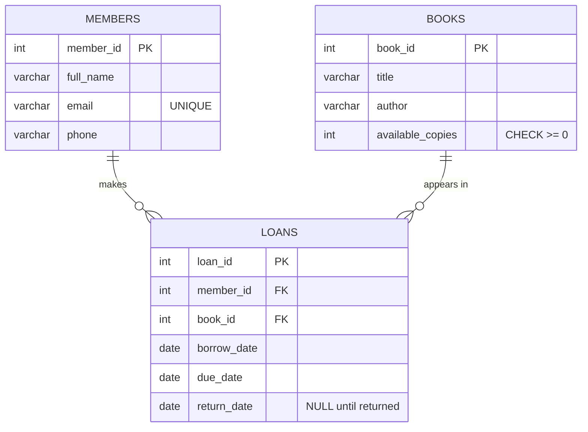

```mermaid
erDiagram
    MEMBERS ||--o{ LOANS : "makes"
    BOOKS   ||--o{ LOANS : "appears in"

    MEMBERS {
        int member_id PK
        varchar full_name
        varchar email "UNIQUE"
        varchar phone
    }
    BOOKS {
        int book_id PK
        varchar title
        varchar author
        int available_copies "CHECK >= 0"
    }
    LOANS {
        int loan_id PK
        int member_id FK
        int book_id FK
        date borrow_date
        date due_date
        date return_date "NULL until returned"
    }
```
